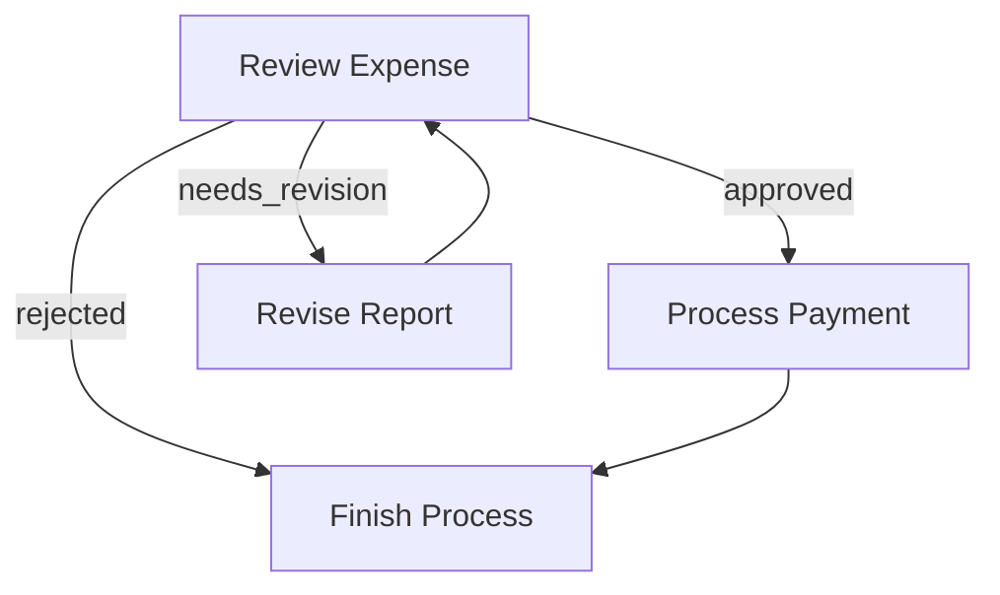

# Flow

A **Flow** orchestrates a graph of Nodes. You connect Nodes through **Actions** (labeled edges).

## 1. Action-based Transitions

Each Node function returns an **Action** string. If it returns nothing (nil), it is treated as `"default"`.

You define transitions with:

1. **Basic default transition**: `node_a >> node_b`
  This means if `node_a` returns `"default"`, go to `node_b`. 

2. **Named action transition**: `node_a:to("action_name", node_b)`
  This means if `node_a` returns `"action_name"`, go to `node_b`.

## 2. Running a Flow

A flow starts from a designated entry node. Use `pf.run(start_node, shared)` to execute the flow.

### Example: Simple Sequence

```lua
local pf = require("orbit")

local node_a = pf.node(function(shared) print("A") end)
local node_b = pf.node(function(shared) print("B") end)

node_a >> node_b

local shared = {}
pf.run(node_a, shared)
```

### Example: Branching & Looping

```lua
local review = pf.node(function(shared)
    -- logic to decide status
    return shared.status -- "approved", "needs_revision", or "rejected"
end)

local payment = pf.node(function(shared) print("Processing payment") end)
local revise = pf.node(function(shared) print("Revising") end)
local finish = pf.node(function(shared) print("Finished") end)

-- Wire transitions
review:to("approved", payment)
review:to("needs_revision", revise)
review:to("rejected", finish)

revise >> review
payment >> finish

pf.run(review, {})
```



### Running Individual Nodes vs. Running a Flow

- `node:run(shared)`: Executes only this node once (with retries if configured).
- `pf.run(node, shared)`: Executes the full flow starting from the given node.

## 3. Nested Flows

In the Lua version, since a flow is just a graph starting from a node, you can nest flows by creating a node that runs another flow:

```lua
local sub_flow_start = pf.node(...)
-- ... setup subflow ...

local nested_node = pf.node(function(shared, item, params)
    return pf.run(sub_flow_start, shared, params)
end)

nested_node >> next_node
```
